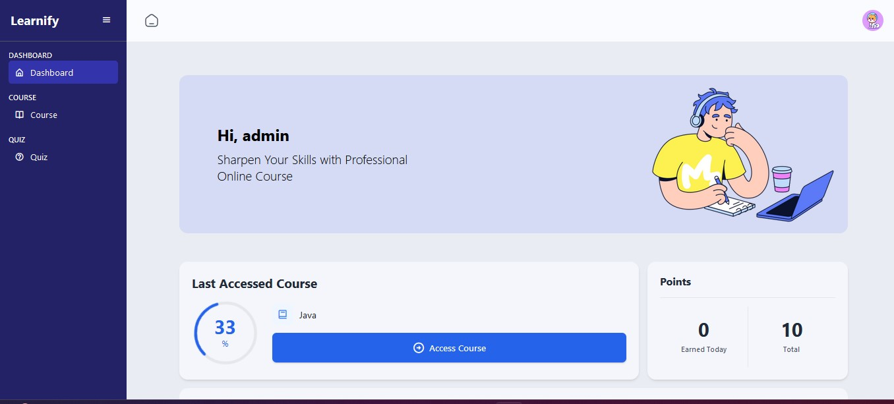
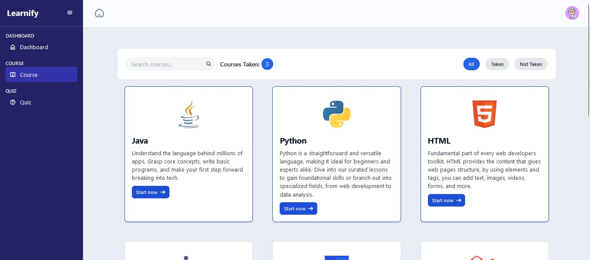
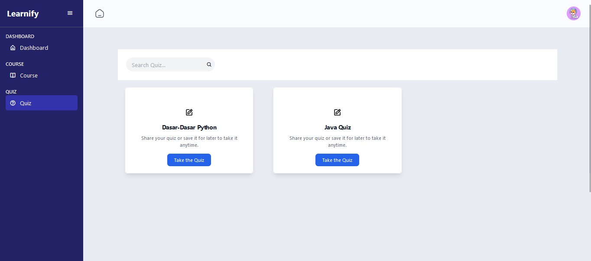

<div align="center">
  
</div>

## Learnify - Elearning - Website

Learnify is an eLearning website designed to revolutionize the way individuals access and engage with educational
content. With a sleek and intuitive user interface, Learnify offers a diverse range of courses, covering everything from
academic subjects to practical skills and professional development.

Key Features:

- Interactive Learning Modules: Dive into immersive learning experiences with interactive modules that cater to various
  learning styles.
- Personalized Learning Paths: Tailor your learning journey with personalized recommendations based on your interests,
  skills, and goals.
- Expert Instructors: Learn from industry experts and experienced educators who provide insightful instruction and
  guidance.
- Assessments and Certifications: Track your progress with quizzes, assignments, and assessments, and earn
  certifications upon course completion.
- Mobile Compatibility: Access Learnify anytime, anywhere, with seamless compatibility across desktop, tablet, and
  mobile devices.

## Our Technology

- **Laravel 11**
- **PostgreSQL**
- **LARAGON**
- **Tailwind CSS**
- **Vanila Javascript**
- **Jquery AJAX**
- **SummerNote API ( text editor feature)**

## How To Use

1. **Clone this repository**
   ```bash
   git clone https://github.com/vincensiusadyatma/Learnify-Elearning-Website.git
   cd Learnify-Elearning-Website
2. **Install PHP Dependencies**
   ```bash
   composer install

3. **Install Javascript Dependencies**
   ```bash
   npm install

3. **Copy .env.example file to .env file**
   ```bash
   cp .env.example .env

4. **Generate App Key**
   ```bash
   php artisan key:generate

4. **Prepare The Database ( If you haven't created "learnify_db" database in PostgreSQL )**
   - Open your PostgreSQL client or terminal
   - Run the following SQL command to create a new database:
       ```bash
       CREATE DATABASE learnify_db;
   - Ensure you have a PostgreSQL user (DB_USERNAME) with the necessary permissions for the database
      ```bash
       CREATE USER postgres WITH PASSWORD 'yourpassword';
       GRANT ALL PRIVILEGES ON DATABASE learnify_db TO postgres;

4. **Configure environment**
   - Open the .env file
   - Update the following database-related lines to match your PostgreSQL configuration
       ```bash
        DB_CONNECTION=pgsql
        DB_HOST=127.0.0.1
        DB_PORT=5432
        DB_DATABASE=learnify_db
        DB_USERNAME=postgres
        DB_PASSWORD=<your password>

4. **Create a symbolic link**
   ```bash
   php artisan storage:link

4. **Run the migrations to database**
   ```bash
   php artisan migrate --seed
   
5. **Run the app**
   ```bash
   npm run project
## App Showcase




## UI/UX Design (figma)
figma : https://www.figma.com/team_invite/redeem/cdMz6QXi35NMbHfVT4IDZ6
## Install and Configure PostgreSQL

- Visit the [PostgreSQL Downloads Page](https://www.postgresql.org/download/) and download the installer for your
  operating system.
- Follow the installation instructions provided by the installer.
- During the setup, you will be prompted to set a password for the `postgres` user. Make sure to remember this password,
  as you will need it for configuring your `.env` file.

## Install Laragon (for Windows Users)

### 5.1 Download and Install Laragon

- Visit the [Laragon Downloads Page](https://laragon.org/download/index.html) and download Laragon.
- Follow the installation instructions to set up Laragon on your machine.

### 5.2 Configure Laragon

- Open Laragon and start the services for Apache, MySQL (even if you're using PostgreSQL, this step ensures that PHP is
  running correctly), and Node.js.
- Add your project to Laragon by placing the project folder in `C:\laragon\www`.
- To access your project, open Laragon's menu, go to `www`, and select your project.

## License

The Laravel framework is open-sourced software licensed under the [MIT license](https://opensource.org/licenses/MIT).
